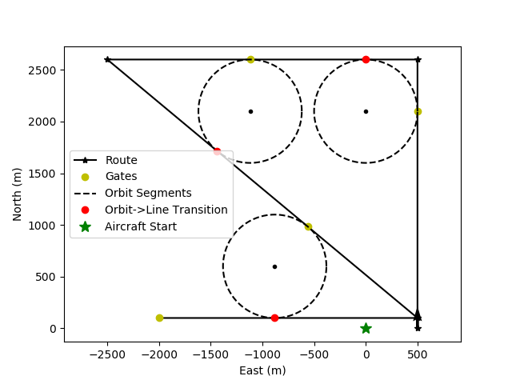

# Project Description

The goal of this optional project from the [Udacity Flying Car Nanodegree Program](https://www.udacity.com/course/flying-car-nanodegree--nd787#) is to implement a flight controller for a fixed-wing aircraft, using the the simulator provided in the [project repo](https://github.com/udacity/FCND-FixedWing). The cascading controller design was similar to the controller designed for the nanodegree program, which was for a quadcopter. The aircraft dynamics was seperated into longitudinal and lateral components and controlled independently to simplify the controller design.

The controller was tested by flying through a series of virtual gates, or waypoints, in the sky. The waypoints specified in the image below were used to generate course headings and elevation changes to be within 5 meters of the gates throughout the flight path.

The following video shows the tuned controller successfully pilot the aircraft through the various flightpaths to complete the final scenario challenge.

